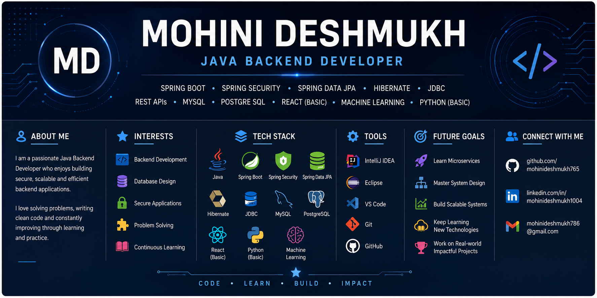
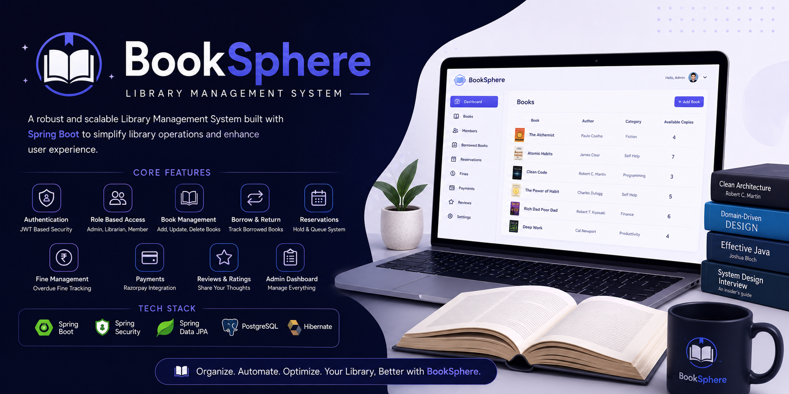
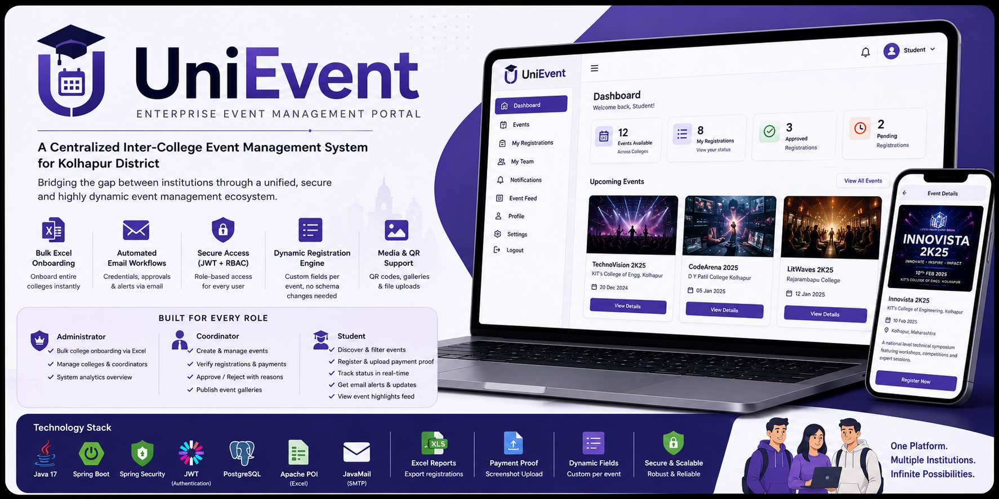
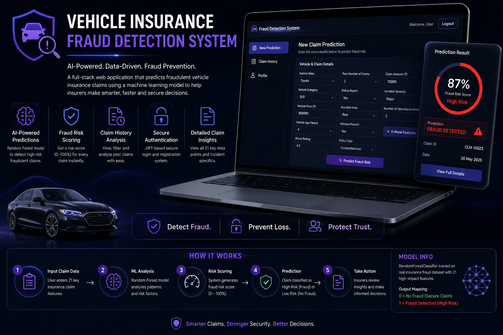

# Hi 👋, I'm Mohini Deshmukh

### Java Backend Developer • Spring Boot • Spring Security • REST APIs

 

---

## 👩‍💻 About Me

I'm a Computer Science student passionate about **Java Backend Development** and building secure, scalable backend applications.

- 💻 Building RESTful backend applications using Spring Boot
- 🔐 Interested in Authentication & Authorization
- 📚 Solving Data Structures & Algorithms problems on LeetCode
- 🌱 Currently exploring **Microservices** and **System Design**

---

## 🚀 Tech Stack

---

## 💼 Skills

| Category | Technologies |
|----------|--------------|
| **Languages** | Java • SQL • Python (Basic) |
| **Backend** | Spring Boot • Spring Security • Spring Data JPA • Hibernate • JDBC • REST APIs |
| **Database** | MySQL • PostgreSQL |
| **Frontend** | React (Basic) |
| **Tools** | IntelliJ IDEA • Eclipse • VS Code • Git • GitHub |
| **Other** | Machine Learning (Fundamentals) |

---

## 🚀 Featured Projects

### 📚 BookSphere – Library Management System

Enterprise-inspired backend application featuring authentication, book management, borrowing workflows, reservations, reviews, and Razorpay integration.

<a href="https://github.com/mohinideshmukh765/BookSphere-LibraryManagementSystem">
<b>⭐ View Repository</b>
</a>

---

### 🎓 UniEvent – Event Management Portal

A centralized inter-college event management platform supporting role-based access, event registration, bulk onboarding, and automated email workflows.

<a href="https://github.com/mohinideshmukh765/UniEvent">
<b>⭐ View Repository</b>
</a>

---

### 🚗 Vehicle Insurance Fraud Detection

A machine learning-powered web application that predicts fraudulent vehicle insurance claims using Flask, React, MySQL, and a Random Forest model.

<a href="https://github.com/mohinideshmukh765/Vehicle-Insurance-Fraud-Detection-System">
<b>⭐ View Repository</b>
</a>

---

## 📚 Currently Learning

- Microservices
- System Design
- Data Structures & Algorithms

---

## 💻 LeetCode

---

## 🤝 Connect With Me

---

### Thanks for visiting my profile!

*Building reliable backend applications while continuously learning, solving problems, and improving as a software engineer.*

